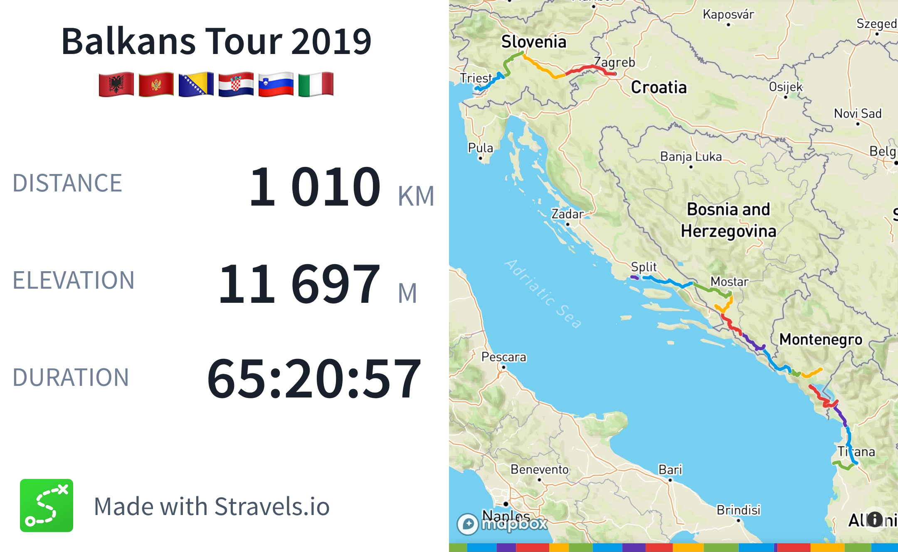
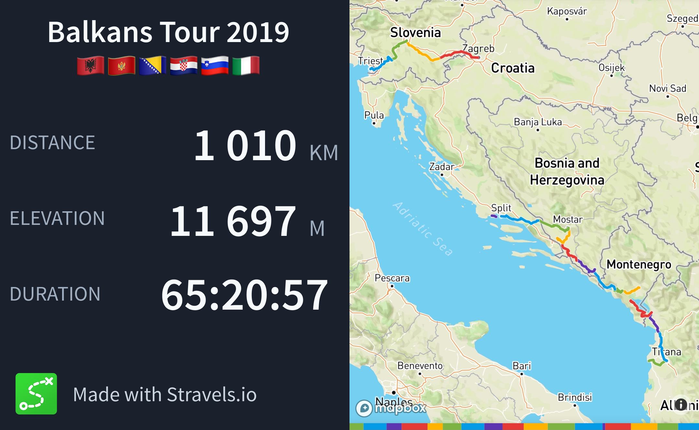

<WideContainer>
  
</WideContainer>

I live in Grenoble, in the French Alps, with my wife and our sons.

My hobbies vary a lot based on my current interests, but playing music (piano/synths & guitar) is always a constant. I'm currently learning woodworking to build toys for my son, and take sunrise hikes to enjoy the surrounding mountains.

I also love cycling, both for transportation and tourism. With my friends, I've toured across 7 countries on my bike, along the French Atlantic coast, in the Alps and in the Balkans:

import { BrowserWindowFrame } from 'ui/components/browser-window-frame'

<BrowserWindowFrame className="block dark:hidden" url="https://stravels.io">
  
</BrowserWindowFrame>

<BrowserWindowFrame className="hidden dark:block" url="https://stravels.io">
  
</BrowserWindowFrame>

This is a screenshot of a progressive web app I made for us to track our
journeys, it's called [Stravels](https://stravels.io) and allowed us to stitch
together our Strava activities onto a map.
