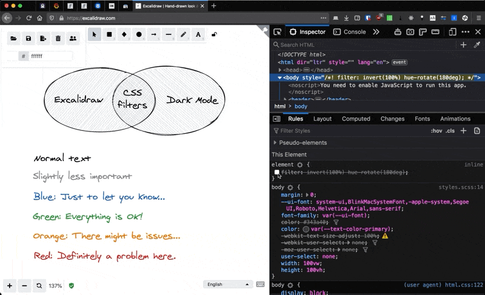

export const metadata = {
  title: 'Dark Mode For Excalidraw',
  description:
    'How to give a dark twist to Excalidraw diagrams with CSS filters.',
  publicationDate: '2020-06-05',
  tags: ['frontend', 'css', 'excalidraw'],
}

If you don't already know about [Excalidraw](https://excalidraw.com),
it's a great simple sketching webapp that got very popular during the COVID-19
crisis when everyone was working from home and needed a virtual drawing board.
It's also been used for
[art](https://twitter.com/excalidraw/status/1248594297559158784),
[cartoons](https://twitter.com/Pinnassog/status/1247893044231168001),
[mockup design](https://twitter.com/imlongnguyen/status/1263766322443214851)
and in many other creative ways.

While building this blog, I wanted to easily embed Excalidraw diagrams and
drawings on blog articles (that's what [Vjeux](https://blog.vjeux.com/) designed it for), but also have it
integrate nicely in Dark Mode.

One simple approach is to keep the white background in the SVG or PNG export:

import { ThemeControls } from 'ui/components/theme-controls'

_Toggle Dark Mode:_ <ThemeControls className="ml-2" />

import VennDiagram from './venn.svg'
import StatusText from './status-text.svg'

<VennDiagram
  arial-label="Venn diagram: [Excalidraw (this post] Dark Mode), with a white background"
  className="mx-auto mb-8 bg-white"
/>

However, for posts with many diagrams, it can lead to eye fatigue when moving
between dark mode text and light mode diagrams.

If we just remove the background, the black lines in the drawing
will almost disappear in dark mode, and the cross-hatch will not look good:

_Toggle Dark Mode:_ <ThemeControls className="ml-2" />

<VennDiagram
  aria-label="The same Venn diagram, but without a background"
  className="mx-auto mb-8"
/>

## CSS Filters To The Rescue

We can use [CSS filters](https://developer.mozilla.org/en-US/docs/Web/CSS/filter)
to change the colours of the SVG. They are supported in
[most browsers](https://caniuse.com/#feat=css-filters),
and allow us to invert the colors when Dark Mode is active:

```css {6}
.excalidraw.light {
  filter: none;
}

.excalidraw.dark {
  filter: invert(100%);
}
```

One problem with inverting all colours this way is that it changes the hue:
blue becomes orange, green becomes pink, and the general nature of the diagram changes.

See what happens when you toggle the theme and only invert the colours:

_Toggle Dark Mode:_ <ThemeControls className="ml-2" />

<StatusText className="dark:filter-invert mx-auto mb-4 max-w-xs" />

The hue change breaks the meaning associated to each line, so we need to keep
the general hue and only invert the lightness.

## Rotating The Hue Back

If we add another filter, we can move the hue back to its initial value, and
therefore only the lightness will have changed:

```css {2}
.excalidraw.dark {
  filter: invert(100%) hue-rotate(180deg);
}
```

_Toggle Dark Mode:_ <ThemeControls className="ml-2" />

<StatusText className="mx-auto mb-4 max-w-xs dark:hue-rotate-180 dark:invert" />

<VennDiagram className="mx-auto mb-4 dark:hue-rotate-180 dark:invert" />

import { GoLightBulb } from 'react-icons/go'

<Note title="Note" icon={GoLightBulb}>
  The brightness of some colors is a little off, but overall this gives a much
  better integration of the drawing on the page.
</Note>

I found this technique on [David Baron](https://dbaron.org/log/20110430-invert-colors)'s
blog, he uses SVG filters instead of CSS, which have [better support](https://caniuse.com/#feat=svg-filters)
but can be slightly more complex to integrate.

## Bonus: Dark Mode For Excalidraw.com

We can also apply the same trick and get Dark Mode on the Excalidraw webapp,
by styling the `body` directly:



There is a [discussion](https://github.com/excalidraw/excalidraw/issues/1148)
on how to integrate an official Dark Mode for Excalidraw in the official GitHub
repository, and I think it would make a great addition to an already wonderful
tool.

Follow me on [Mastodon](https://mamot.fr/@Franky47) for more hacks and front-end design tips!
