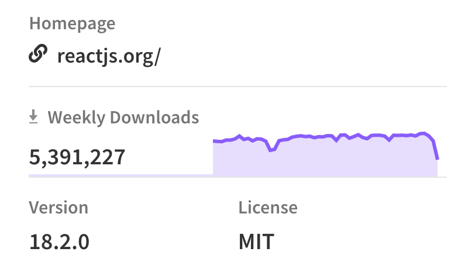

export const metadata = {
  title: 'NPM download stats are down',
  description: 'And people are drawing the funniest conclusions',
  tags: ['npm'],
  publicationDate: '2023-09-21',
}

<Note status="info">
As of 2023-09-24, the problem seems to have been resolved.

Stats are now returning to normal, and previous zero values have been restored.

</Note>

I noticed the problem on 2023-09-14, while I was working on my
[NPM package embed](https://github.com/franky47/francoisbest.com/blob/next/packages/francoisbest.com/src/ui/embeds/npm-package.tsx).

It looks like this, showing NPM download stats for the last 30 days:

<NpmPackage
  pkg="react"
  repo="facebook/react"
  accent="text-cyan-500 dark:text-cyan-400"
/>

After seeing the latest download stats zero-out, I thought it was a bug in my code,
but a quick call to the NPM registry API confirmed there's an issue across the whole registry:

```shell {12,16,32,36,40}
$ curl -s https://api.npmjs.org/downloads/range/2023-09-12:2023-09-20/ | jq .

{
    "start": "2023-09-12",
    "end": "2023-09-20",
    "downloads": [
        {
            "downloads": 10511123926,
            "day": "2023-09-12"
        },
        {
            "downloads": 0,
            "day": "2023-09-13"
        },
        {
            "downloads": 0,
            "day": "2023-09-14"
        },
        {
            "downloads": 8912767625,
            "day": "2023-09-15"
        },
        {
            "downloads": 2444583811,
            "day": "2023-09-16"
        },
        {
            "downloads": 2260617731,
            "day": "2023-09-17"
        },
        {
            "downloads": 0,
            "day": "2023-09-18"
        },
        {
            "downloads": 0,
            "day": "2023-09-19"
        },
        {
            "downloads": 0,
            "day": "2023-09-20"
        }
    ]
}
```

And indeed, other popular packages show the same decline:

<NpmPackage
  pkg="vue"
  repo="vuejs/core"
  accent="text-emerald-500 dark:text-emerald-400"
/>

<NpmPackage
  pkg="@angular/core"
  repo="angular/angular"
  accent="text-red-500 dark:text-red-400"
/>

After a couple of days, it started to show on NPM's own website:



Reddit and Hacker News users were quick to react, with some hilarious comments:

> Bun 1.0 is out, so everyone is switching to that.

> You should use PNPM anyway.

<Note status="info">
  Bun and PNPM use the NPM registry by default, so using them also counts
  towards the download stats.
</Note>

Some folks were prompt to draw ominous conclusions:

> Well, that confirms it, javascript and front end development is dead. I'll start looking for a new job.

> This proves React is dead, you should use Svelte now.
>
> {/* prettier-ignore */}
> <figcaption className="not-italic">Someone who didn't notice Svelte stats were also down:</figcaption>

<NpmPackage
  pkg="svelte"
  repo="sveltejs/svelte"
  accent="text-orange-500 dark:text-orange-400"
/>

## Official response from NPM

I contacted NPM support on 2023-09-15, but didn't get much of a useful response:

> Yes, we also see the zero download count on different packages.
>
> This issue remains under investigation.
>
> We will let you know once we have an update.

## Resolution

As of 2023-09-24, the problem seems to have been resolved.
Stats are returning to normal, and previous zero values have been restored for
all tested packages.
