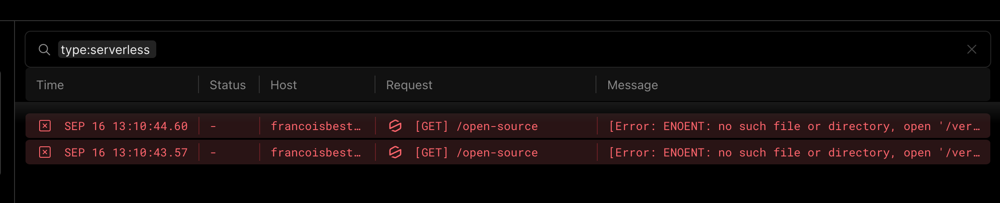

export const metadata = {
  title: 'Reading files on Vercel during Next.js ISR',
  description:
    'A little hack to let the Next.js file tracer pick up relative file paths.',
  tags: ['til', 'nextjs', 'vercel'],
  publicationDate: '2023-09-16',
}

React Server Components are a great addition to Next.js, allowing us to use
server-side APIs in our components, like accessing the file system with `fs.readFile`.

## Relative file paths in ESM

In ESM, `import.meta.url` points to the current file _"URL"_. For Node.js programs, it looks like this:

```txt
file://absolute/path/to/file.ts
```

In CommonJS, we used to have `__filename` and `__dirname`. As an aside,
we can trivially rebuild them in ESM using a little path manipulation:

```ts
import { fileURLToPath } from 'node:url'
import path from 'node:path'

const __filename = fileURLToPath(import.meta.url)
const __dirname = path.dirname(__filename)
```

I'm using this extensively [in this website](https://github.com/franky47/francoisbest.com)
to resolve **relative paths**:

```ts
export function resolve(importMetaUrl: string, ...paths: string[]) {
  const dirname = path.dirname(fileURLToPath(importMetaUrl))
  return path.resolve(dirname, ...paths)
}

// Example usage:
resolve(import.meta.url, './relative/path.txt')
```

## The issue with Vercel and Next.js ISR

This pattern works fine when developping locally and when building the Next.js
application on Vercel, but it fails in an **Incremental Static Regeneration** (ISR)
context:



```txt
[Error: ENOENT: no such file or directory, open '/vercel/path0/path/to/file.txt'] {
  errno: -2,
  code: 'ENOENT',
  syscall: 'open',
  path: '/vercel/path0/path/to/file.txt'
}
[Error: An error occurred in the Server Components render. The specific message is omitted in production builds to avoid leaking sensitive details. A digest property is included on this error instance which may provide additional details about the nature of the error.] {
  digest: '2649891783'
}
```

That's because ISR runs in serverless functions, which are **bundled**, and the
Next.js file tracer hasn't been able to pick the file we needed, as it relies
on static tracing.

## The fix

To tell the file tracer to pick up our file, we have to use `process.cwd()`.

<Note status="info">
`process.cwd()` will point to the root of the **Next.js application**.

In a monorepo like this website, this may be different than the **repository root**.

</Note>

Our `resolve` function can then be updated like this:

```ts title="src/lib/paths.ts"
import path from 'node:path'
import { fileURLToPath } from 'node:url'

// src/lib
const __dirname = path.dirname(fileURLToPath(import.meta.url))
const nextJsRootDir = path.resolve(__dirname, '../../')

export function resolve(importMetaUrl: string, ...paths: string[]) {
  const dirname = path.dirname(fileURLToPath(importMetaUrl))
  const absPath = path.resolve(dirname, ...paths)
  // Required for ISR serverless functions to pick up the file path
  // as a dependency to bundle.
  return path.resolve(process.cwd(), absPath.replace(nextJsRootDir, '.'))
}
```

And now Vercel doesn't complain about missing files on ISR updates. 🎉
