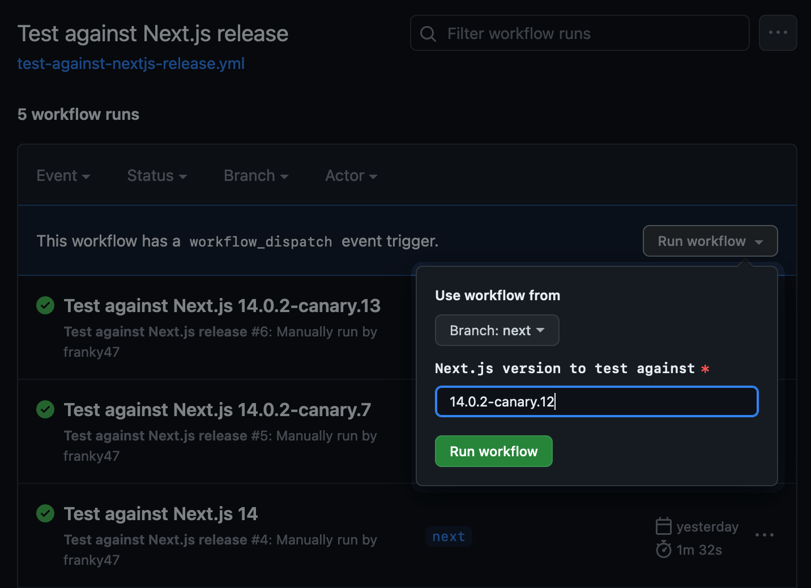

export const metadata = {
  title: 'Testing against every Next.js canary release',
  description:
    'How to run a GitHub Actions workflow when a new pre-release version of Next.js is published.',
  tags: ['next.js', 'github-actions', 'testing'],
  publicationDate: '2023-11-06'
}

I recently got a [bug report](https://github.com/47ng/next-usequerystate/issues/388)
on [`next-usequerystate`](https://github.com/47ng/next-usequerystate)
that was only present in a recent canary _(pre-release)_ version of Next.js.

Initially, I shrugged it off as not wanting to maintain support for canary
releases, since the Next.js team tends to push those out a couple of times a day.

But since the library is subject to the App router's whims, I'd like to make
sure I catch issues as early as possible, without waiting for the next stable
release.

This is something that is prime for **automation**: how can I run the CI suite
on _every_ new canary release of Next.js?

Unfortunately, doing so in a "clean" manner would require setting up a WebHook
on the Next.js repository, which is not an option. There may be other services
out there that provide RSS feeds for releases or a way to subscribe to new
releases, but I don't want to depend on a third-party service for this.

Instead, I'll use a good old **cron** job to check for new releases every 15 minutes,
using the GitHub API, and trigger a workflow run if a new release is found.

But first, we need something to trigger.

## GitHub Actions workflow

Using the `workflow_dispatch` event, I can trigger a run manually from the
GitHub web UI, but also from the REST API.

```yml title="test-against-nextjs-release.yml" /workflow_dispatch/
name: 'Test against Next.js release'

on:
  workflow_dispatch:
```

Then I can define a `version` input for it, to tell the CI suite which version
of Next.js to install and test against:

```yml title="test-against-nextjs-release.yml" /version/1-2
# Bonus: make it look nice in the runs list
run-name: 'Test against Next.js ${{ inputs.version }}'

on:
  workflow_dispatch:
    inputs:
      version:
        description: 'Next.js version to test against'
        required: true
        type: string
```

Finally, I add the rest of the CI suite, along with a custom install step
to override the Next.js version in the playground where the end-to-end tests run:

```yml title="test-against-nextjs-release.yml" /pnpm add --filter playground next@${{ inputs.version }}/
name: 'Test against Next.js release'

# Bonus: make it look nice in the runs list
run-name: 'Test against Next.js ${{ inputs.version }}'

on:
  workflow_dispatch:
    inputs:
      version:
        description: 'Next.js version to test against'
        required: true
        type: string

jobs:
  test_against_nextjs_release:
    name: Integration
    runs-on: ubuntu-latest
    steps:
      - uses: actions/checkout@b4ffde65f46336ab88eb53be808477a3936bae11
      - uses: pnpm/action-setup@d882d12c64e032187b2edb46d3a0d003b7a43598
        with:
          version: 8
      - uses: actions/setup-node@8f152de45cc393bb48ce5d89d36b731f54556e65
        with:
          node-version: lts/*
          cache: pnpm
      - name: Install dependencies
        run: pnpm install
      - name: Install Next.js version ${{ inputs.version }}
        run: pnpm add --filter playground next@${{ inputs.version }}
      - name: Run integration tests
        run: pnpm run ci
        env:
          TURBO_TOKEN: ${{ secrets.TURBO_TOKEN }}
          TURBO_TEAM: ${{ secrets.TURBO_TEAM }}
```

import Link from 'next/link'

<Note status="info" title="Why all the SHA-1?">
  I like to pin my dependencies to a specific commit, and Dependabot is smart
  enough to update them for me.{' '}
  <Link href="/posts/2020/the-security-of-github-actions">Read more</Link>.
</Note>

Now I can trigger this manually from the GitHub web UI:



To do the same from the REST API, I can call:

```bash
curl -s
  -X POST
  -H "Accept: application/vnd.github.v3+json"
  -H "Authorization: token $GITHUB_TOKEN"
  -H "X-GitHub-Api-Version: 2022-11-28"
  -d '{"ref":"next","inputs":{"version":"14.0.2-canary.12"}}'
  "https://api.github.com/repos/47ng/next-usequerystate/actions/workflows/test-against-nextjs-release.yml/dispatches"
```

This will require a Personal Access Token with the `repo` scope, or a fine-grained
token with the `Actions:write` permission. I went with the latter as they
can expire and allow for rotation. This will run on my Raspberry Pi at home.

## Delayed windowing

The cron script will run every 15 minutes, but I don't want to simply look for
releases made in the _"last 15 minutes"_, for a couple of reasons:

1. The Next.js release script might take a while to complete (in case the package
   on NPM is only available **after** the GitHub release has been published).
2. A release might be rolled back or unpublished

To do that, the cron script will look for releases made between 15 and 30 minutes
**before its invocation**:

import Windowing from './windowing.svg'

<Windowing
  className="mb-8 dark:hue-rotate-180 dark:invert"
  aria-label="The arrow of time is divided in 15 minute intervals. A release 'a' is published around 12:06, which is handled in the 12:30 cron run. Another release 'b' is published around 12:35, which is handled in the 13:00 cron run. Finally, two releases 'c' and 'd' are published close to each other at 12:50 and 12:55, and both handled in the 13:15 cron run."
/>

Notice how there may be more than one release in a 15-minute window? The script will
need to handle that too, to run the workflow **for each** release. This will help
fish out which one introduced an issue.

## Cron script

Here's the final cron script _(big thanks to the LLMs, I'm not a Bash person)_:

```bash
#!/usr/bin/env bash
# crontab -e:
# */15 * * * * /home/pi/next-usequerystate/watch-nextjs-releases.sh

set -e

# Use a classic PAT with the `repo` scope,
# or a fine-grained access token with the Actions:write permission.
TOKEN=your-github-token-here

# The repository to read Releases from
SOURCE_REPO=vercel/next.js

# Configure where to trigger workflow calls
TARGET_REPO=47ng/next-usequerystate
TARGET_WORKFLOW=test-against-nextjs-release.yml
TARGET_BRANCH=next

# Delayed window: give time for the release to be stabilised or revoked
t_start=$(date -u --date="30 minutes ago" +"%Y-%m-%dT%H:%M:%SZ")
t_end=$(date -u --date="15 minutes ago" +"%Y-%m-%dT%H:%M:%SZ")

# Query the GitHub API for releases
response=$(curl -s "https://api.github.com/repos/$SOURCE_REPO/releases")

# Only keep releases in the window
recent_releases=$(            \
  echo "$response"            \
  | jq                        \
    --arg t_start "$t_start"  \
    --arg t_end "$t_end"      \
    '.[] | select(.published_at >= $t_start and .published_at <= $t_end)' \
  )

echo "Time range: $t_start -> $t_end"
echo "Releases:"
echo $recent_releases | jq -r '.name'

trigger_workflow() {
  local version="$1"
  local trigger_url="https://api.github.com/repos/$TARGET_REPO/actions/workflows/$TARGET_WORKFLOW/dispatches"
  local data="{\"ref\":\"$TARGET_BRANCH\",\"inputs\":{\"version\":\"$version\"}}"
  local response=$(                               \
    curl                                          \
      -s                                          \
      -X POST                                     \
      -H "Authorization: token $TOKEN"            \
      -H "Accept: application/vnd.github.v3+json" \
      -d "$data"                                  \
      "$trigger_url"                              \
  )
  echo "$response"
  echo "Triggered workflow for version $version"
}

for release in $(echo "$recent_releases" | jq -r '.name'); do
  # Remove the leading 'v' from the release name
  version="${release#v}"
  trigger_workflow "$version"
done
```

<Note status="info" title="TIL about matching in parameter expansion" icon="🤩">

You can do [this](https://www.gnu.org/software/bash/manual/html_node/Shell-Parameter-Expansion.html) in Bash apparently, no `sed` required:

```bash
# Remove the leading 'v' from the release name
version="${release#v}"
```

</Note>

## What's next for useQueryState?

Next up on the [roadmap](https://github.com/47ng/next-usequerystate/issues/375)
is to rework the documentation, as the README starts becoming a bit too long
to read comfortably, and merge it with the [playground](https://next-usequerystate.vercel.app),
to show actual use-cases and examples.

In the mean time, you can find the project here:

<NpmPackage pkg="next-usequerystate" repo="47ng/next-usequerystate">

<div className="pointer-events-none absolute -bottom-4 right-8 md:right-12">
  
</div>

</NpmPackage>

<Note title="Hey, Vercel!" icon="👀">
  If anyone at Vercel reads this, it looks like your Dashboard is still using
  `1.8.0-beta.11`, you might want to update. 😉
</Note>
